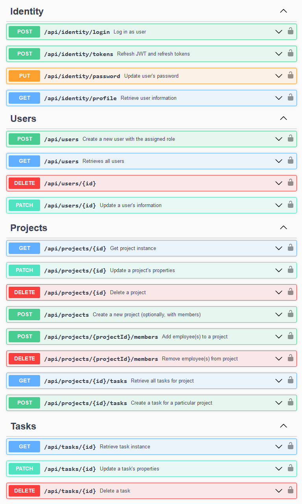

   

# Employee Administration
.NET API for the administration of employees, projects, and their relations (tasks and members)

- Clean architecture with UoW & Services patterns
- Database & file error logging

Features:
- *JWT authentication*
- User roles *caching* (with Redis) for authorization assistance
- Cloudinary as *image storage* for user profile pictures

### API endpoints

### How to run project
- Clone project ``git clone https://github.com/stealacamera/Employee-Administration-Api.git``
- Open project in Visual Studio
- Click ``Run Docker Compose``
